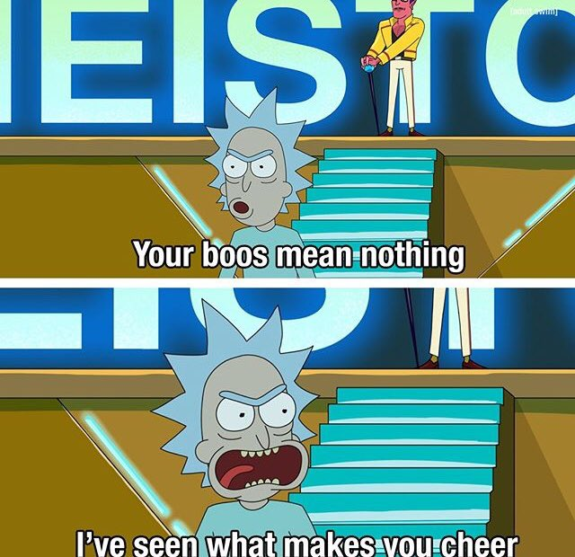

     

## 👨🏻‍💻 &nbsp;About Me

  
  
  

    
- 🚀 Passionate about building cool projects and solving real-world problems.  
- 💡 Always learning and exploring new technologies.  
- 🔥 Experienced in JavaScript, Python, Java, and more!  
- 🎯 Love working on web development, AI, and automation.  
- 🛠️ Currently working on exciting personal projects.  
- 🐞 Fixing bugs I created while fixing bugs.
  
  

&nbsp;

---

## 🛠 &nbsp;Tech Stack

&nbsp;
&nbsp;
&nbsp;
&nbsp;
&nbsp;
&nbsp;

&nbsp;
&nbsp;
&nbsp;
&nbsp;

&nbsp;
&nbsp;
&nbsp;
&nbsp;
&nbsp;
&nbsp;
&nbsp;
&nbsp;

&nbsp;
&nbsp;
&nbsp;
&nbsp;

&nbsp;
&nbsp;
&nbsp;
&nbsp;
&nbsp;
&nbsp;

&nbsp;
&nbsp;
&nbsp;
&nbsp;
&nbsp;
&nbsp;
&nbsp;
&nbsp;
&nbsp;
&nbsp;

&nbsp;
&nbsp;
&nbsp;
&nbsp;
&nbsp;

&nbsp;
&nbsp;
&nbsp;
&nbsp;
&nbsp;
&nbsp;
&nbsp;

&nbsp;
&nbsp;
&nbsp;
&nbsp;

&nbsp;
&nbsp;
&nbsp;

&nbsp;
&nbsp;
&nbsp;
&nbsp;

&nbsp;
&nbsp;
 
<!--                 
-->

## ⚙️ &nbsp;GitHub Analytics

  
  &nbsp;&nbsp;&nbsp;&nbsp;
  

---

## ✍️ &nbsp;Random Dev Quotes

  
  &nbsp;&nbsp;&nbsp;&nbsp;
  

## 📫 &nbsp; Connect with me:

 &nbsp;
 &nbsp;
 &nbsp;

